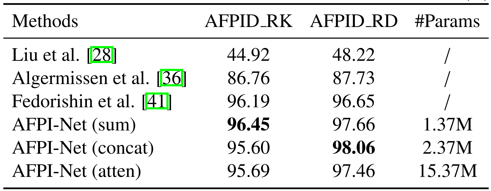
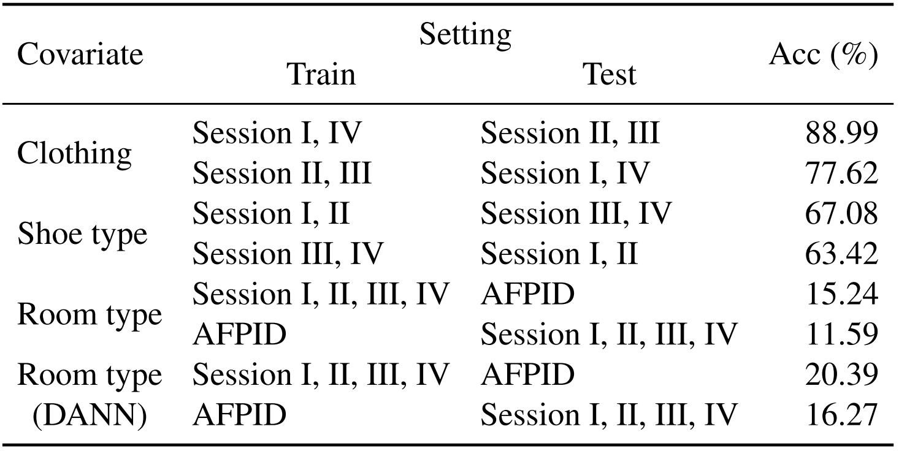

# Advanced acoustic footstep-based person identification dataset and method using multimodal feature fusion

This is a PyTorch implementation of our underview [manuscript]().

**AFPID-II:** Improved Acoustic Footstep-based Person Identification Dataset.
**AFPI-Net:** Acoustic Footstep based Person Identification Network.

## Acess to the AFPID-II dataset and this source code
 **Note: The source code and the AFPID-II dataset is free for non-commercial research and education purposes.** Any commercial use should get formal permission first.
 
 The code and dataset are released under the [Creative Commons Attribution-NonCommercial-ShareAlike 4.0 International Public License](https://creativecommons.org/licenses/by-nc-sa/4.0/legalcode) for NonCommercial use only. 

 
The AFPID-II dataset could be downloaded from [Baidu pan](https://pan.baidu.com/s/1a1RGukdWxCyvdY5UEpBi_w) fetch code: 6y28 or [Google drive](https://drive.google.com/file/d/1oiIam9BQ6gAA-zKhQQEU97UFJ13I8uLa/view?usp=share_link).

Please cite our paper if you use any part of our source code or data in your research.


## Requirement
- python>=3.9.7
- audioread>=2.1.9
- PyTorch>=1.12.1
- torchvision>=0.13.1
- pandas>=1.4.4
- librosa>=0.8.1 
- h5py>=3.7.0
- numpy>=1.20.3
- scikit-learn>=1.0.1
- scipy>=1.7.3


## Usage 

Download the [AFPID-II dataset](https://drive.google.com/file/d/1oiIam9BQ6gAA-zKhQQEU97UFJ13I8uLa/view?usp=share_link) and prepare the directory following the below structure: 
```
├── ../data/acoustic_footstep
│   ├── AFPID-Raw
│   |    ├── S01
│   |    ├── S02
│   |    ├── ...
│   |    ├── S13
│   |    ├── fse_sep_tim_vec_cell.mat
│   ├── AFPID-II_P2-Raw
│   |    ├── S01
│   |    ├── S02
│   |    ├── ...
│   |    ├── S40
│   |    ├── afpid_ii_p2_fse_sep_tim_vec.mat
```

1. Generate various dataset variants with files in ./scripts, including audio feature extraction: 
```
> python process_AFPID_FE1.py 
> python process_AFPID_II_P2_FE1.py
```

2. Train the model with parameters adjusted in ./configs/wave_hcraft_spec_fusion.json: 
```
> python train.py
```

3. To evaluate the model: 

```
> python test_afpinet.py
```

## Results 

<p align="center">
     <br/>
    <em> 
    Figure 1:Person identification scores on AFPID_RK and AFPID_RD (%).
    </em>
</p>

<p align="center">
     <br/>
    <em> 
    Figure 2: Person classification results on AFPID-II concerning multiple covariates.
    </em>
</p>


## Code References
In this Codebase, we utilize code from the following source(s):

* [wave-spec-fusion](https://github.com/denfed/wave-spec-fusion) 

